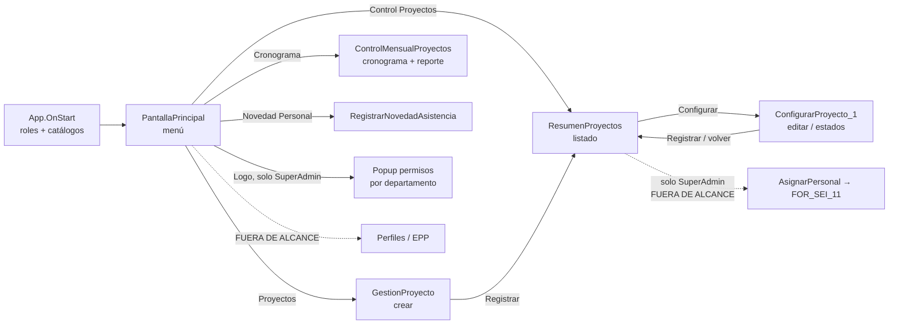
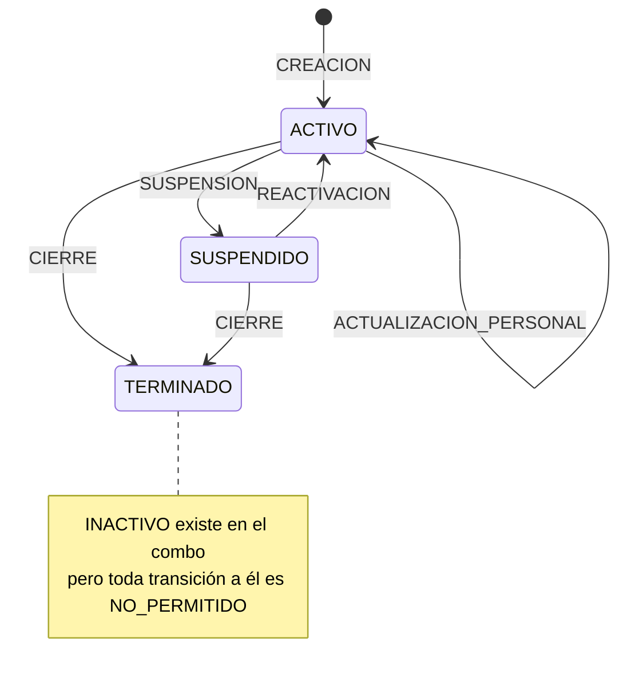

# FASE 1 — Análisis funcional (Módulo Proyectos)
 
**App:** PROFESIOGRAMA (SEDEMI) · **Alcance:** Proyectos (crear, control, editar/estados), Cronograma (+ reporte Excel), Novedades y administración de permisos.
**Fuera de alcance:** Perfiles, EPP, Asistencia FOR SEI 11/12, AsignarPersonal, ASISTENCIAVISUALIZACION, AST.
 
---
 
## 1. Mapa de pantallas y navegación
 

 
| Menú | Visible para | Destino |
|---|---|---|
| Proyectos | Correo contenido en texto de `PermisosGenerales` (fila 666) **o** SuperAdmin | GestionProyecto |
| Control Proyectos | Igual | ResumenProyectos |
| Cronograma Proyectos | Igual | ControlMensualProyectos |
| Novedad Personal | Igual | RegistrarNovedadAsistencia |
| Logo (popup permisos) | Solo SuperAdmin | Popup en PantallaPrincipal |
 
---
 
## 2. Análisis por pantalla
 
### 2.1 App.OnStart
 
| Elemento | Detalle |
|---|---|
| `varEsSuperAdmin` | 5 correos fijos en código. |
| `varRegistroPermisos` | `LookUp('SIG PROYECTOS', Título="666")` — fila de configuración. |
| `varUsuarioAutorizadoEnJSON` | `Email in PermisosGenerales` (búsqueda por subcadena en texto). |
| `varUegpsCalculadas` | Departamentos del usuario según JSON 666 (7 claves). Se guarda en `INF_GENERAL.InfoRegistro.Uegp` (solo informativo). |
| `colCatalogoNovedades` | Catálogo fijo: CALAMIDAD DOMESTICA (CD), DESCANSO (D), FERIADO (FER), PATERNIDAD (PTNDAD), PERMISO (P), VACACIONES (V). Todos `CategoriaId=5`, `EstadoExcel=LIBRE`. |
| Resto | Inicialización de ~15 colecciones vacías (patrón de tipado). |
 
### 2.2 PantallaPrincipal (menú + administración de permisos)
 
- **Popup de permisos (SuperAdmin):** 7 columnas (Infraestructura Integral, Telecom, Petróleo y Gas, Energía, Infraestructura Metálica, Minería, SIG). Agrega personas desde `ESTRUCTURA GENERAL` (`Estado="A"`, `Grupo="ADMINISTRATIVO"`), evita duplicados por `Usuario`, marca `Notificado=false`.
- **Guardar:**
  1. Arma lista de nuevos (`Notificado=false`), agrupa departamentos por correo.
  2. Llama `ReporteProyectosSIG.Run(json, "NOTIFICAR", "")` → correo de acceso.
  3. Marca `Notificado=true`.
  4. `Patch` de `PermisosGenerales` en fila 666 (JSON completo).
| Lee | Escribe | Flujos |
|---|---|---|
| SIG PROYECTOS (666), ESTRUCTURA GENERAL | SIG PROYECTOS (666).PermisosGenerales | ReporteProyectosSIG (NOTIFICAR), ConsultarProyecto (COMPANIAS, HORARIOS al entrar a Proyectos) |
 
### 2.3 GestionProyecto (crear proyecto)
 
**Cabecera**
 
| Control | Origen | Regla |
|---|---|---|
| Compañía | API COMPANIAS | Al cambiar: carga DIMENSIONES y PROYECTOS; resetea hijos. Nombre = `tradeName ?? name`. |
| Grupo | Fijo: CAMPO, PLANTA, OFICINAS ADMINISTRATIVAS | CAMPO → Proyecto + Actividad. PLANTA/OFICINAS → Dimensión (UEGP). |
| Proyecto | API PROYECTOS filtrado `status="Activo"` | Al cambiar: carga ACTIVIDADES; aviso si vacío. |
| Actividad | API ACTIVIDADES | Guarda id, descripción, tipo. |
| Dimensión | API DIMENSIONES | Guarda `uegpId`, descripción. |
| Fecha inicio / fin | DatePicker | fin ≥ inicio. |
| Horario | API HORARIOS filtrado `status="A"` | Guarda código, descripción, entrada, salida, horas, horas trabajadas, tipo. |
| Salida almuerzo | Fijo 11:00–14:00 | — |
| Regreso almuerzo | Fijo 12:00–15:00 | Debe ser > salida. |
 
**Personal**
 
| Elemento | Regla |
|---|---|
| Principales | Máx. 20. El primero es `EsPrincipalInicial` y hereda la fecha de inicio del proyecto. Jornada obligatoria. |
| Jornadas | TIPO_1 22-8, TIPO_2 11-4, TIPO_3 5-2, ESPECIAL 3-0. |
| Backs | Máx. 20. `TipoRegistro`: Jornada o Descanso. `DiasDescanso` 0–20 (descanso posterior, solo si es Jornada). |
| Búsqueda de personas | `ESTRUCTURA GENERAL` (`Estado="A"`, `Grupo="ADMINISTRATIVO"`) filtrado por departamentos del usuario (regex sobre JSON 666) o por `Unidad Gestión` para "unidades especiales". El ícono **"Ver otros departamentos"** quita el filtro → no es control de seguridad. |
 
**Botón Generar — validaciones**
1. Fechas del proyecto obligatorias; fin ≥ inicio.
2. Principales con correo, fechas y jornada.
3. Fechas de principales y backs dentro del rango del proyecto.
4. Backs con correo y fechas.
**Botón Generar — algoritmo**
- **Principal:** ciclo = trabajo + descanso; bloques = ⌈días / ciclo⌉; cada bloque trabaja `DiasTrabajo` días desde `inicio + (n-1)·ciclo`, recortado a su fecha fin. Rol `PRINCIPAL`, tipo `AUTO`.
- **Back:** un tramo `MANUAL` (rol `BACK` o `DESCANSO` según `TipoRegistro`) + tramo `DESCANSO` de `DiasDescanso` días posteriores si es Jornada.
- **Cruces:** (a) internos: mismo EKON y fecha > 1 (ignora DESCANSO); (b) otros proyectos ACTIVO/SUSPENDIDO leídos del **JSON `ASIGNACIONES`** (C6).
- Resumen de cruces agrupado por persona / rol / proyecto / mes.
**Botón Registrar — secuencia (sin transacción)**
 
| Paso | Acción | Lista |
|---|---|---|
| 1 | Validar horario + almuerzo, asignación generada y sin cruces | — |
| 2 | `ProjectUID = GUID()`; `Código = "PRY-" + yyyymmdd + "-" + últimos 6 del GUID` | — |
| 3 | Generar descansos automáticos del principal: tras cada bloque, si el día siguiente está libre, `DiasDescanso` días dentro de su tramo | — |
| 4 | Filas de detalle con clave `UID\|EKON\|fecha\|ROL`, sin duplicados | — |
| 5 | Cabecera (JSON legado + columnas planas, `MIGRADO=false`) | SIG PROYECTOS |
| 6 | Principales y backs | SIG_ASIGNACIONES_PERSONAL |
| 7 | Detalle diario | SIG_ASIGNACIONES_DETALLE |
| 8 | Etapa `CREACION`, versión 1, snapshot JSON | SIG_HISTORIAL |
| 9 | Actividad inicial (solo si hay actividad) | SIG_HISTORIAL_ACTIVIDADES |
| 10 | `MIGRADO=true` si todo salió bien | SIG PROYECTOS |
 
- **Nombre visual:** `NombreProyecto ?? "PLANTA - " + Dimensión` (también para OFICINAS ADMINISTRATIVAS).
- **Usuario creador:** `Office365Users.MyProfileV2()` (displayName, UPN en minúsculas).
### 2.4 ResumenProyectos (control / listado)
 
| Aspecto | Detalle |
|---|---|
| Fuente | `SIG PROYECTOS` con `StartsWith(Título,"PRY-")` (excluye 666). |
| Filtros | Estado (Todos/ACTIVO/SUSPENDIDO/INACTIVO/TERMINADO); rango sobre **`Creado`** (fecha de registro, no del proyecto); fecha fin por defecto = hoy. |
| Seguridad | SuperAdmin ve todo; resto solo `CORREO_CREADOR = su correo`. |
| Columnas | Nombre, Responsable (LookUp por fila a PERSONAL principal inicial), Backs (Distinct por fila), Inicio, Fin, Horario, Estado. |
| Acción Configurar | Carga cabecera (columnas), PERSONAL, DETALLE (excluye descansos automáticos de principal), HISTORIAL, HISTORIAL_ACTIVIDADES, actividades API; copia "original"; navega a ConfigurarProyecto_1. |
| Acción FOR SEI 11 | Solo SuperAdmin → AsignarPersonal (fuera de alcance). |
 
### 2.5 ConfigurarProyecto_1 (editar proyecto)
 
| Editable | Regla |
|---|---|
| Actividad (solo CAMPO) | Si cambia, exige "fecha desde" dentro del rango. Cierra la actividad anterior el día previo y abre una nueva (`CAMBIO_ACTIVIDAD`). Reemplaza **todo** `SIG_HISTORIAL_ACTIVIDADES` del proyecto. |
| Fecha inicio / fin | Controles editables. **La fecha inicio no se guarda** en cabecera (C24). |
| Estado | Máquina de estados (abajo). |
| Principales / backs | Solo se agregan o quitan los **nuevos**. Los históricos se muestran en solo lectura. |
| Compañía, proyecto, dimensión, horario | Solo lectura (C25: horario no editable). |
 
**Máquina de estados**
 

 
| Movimiento | Efecto |
|---|---|
| SUSPENSION / CIERRE | Pide fecha (≥ inicio, ≤ fin). Recorta detalle a `Fecha ≤ fechaMovimiento`, recorta principales/backs a esa fecha. `FECHA_FIN` = fecha del movimiento. |
| REACTIVACION | Pide fecha. Carga automáticamente el último principal inicial como nuevo principal desde esa fecha. Exige Regenerar. Fecha de corte = fecha de reactivación. |
| ACTUALIZACION_PERSONAL | Cambios de personal sin cambio de estado. Fecha de corte = hoy. |
 
**Regenerar**
- Base intacta: detalle con `Fecha < fechaCorte`.
- Personas existentes se regeneran desde la fecha de corte; personas **nuevas** conservan su fecha de inicio (pueden generar días pasados).
- Cruces: internos, contra histórico propio y contra **otros proyectos vigentes** leídos de `SIG_ASIGNACIONES_DETALLE` (por EKON y rango).
**Registrar (delta-write, sin transacción)**
1. Validaciones: regenerado, sin cruces, cambio de actividad con fecha válida, cambio de estado aplicado.
2. Personal a guardar: históricos cerrados antes del corte + vigentes/nuevos.
3. Recalcula descansos automáticos de principales.
4. `Remove` DETALLE con `FECHA ≥ corte` → `Collect` nuevas filas.
5. `Remove` **todo** PERSONAL del proyecto → reinserta.
6. Nueva etapa en SIG_HISTORIAL (`VERSION = conteo + 1`).
7. Si cambió actividad: borra y reinserta SIG_HISTORIAL_ACTIVIDADES.
8. `Patch` cabecera: JSON legado, ESTADO, FECHA_FIN, ACTIVITY_*, `MIGRADO=true`.
### 2.6 ControlMensualProyectos (cronograma + reporte)
 
**OnVisible**
- Cabecera liviana de proyectos (`ShowColumns`), filtrada por creador si no es SuperAdmin.
- **Todas** las novedades: `ForAll('NOVEDADES ASISTENCIA')` + `ParseJSON(DETALLE_JSON)` → expande días (no delegable, tope 2.000 filas).
- Auto-carga del mes actual.
**Ver cronograma**
 
| Paso | Regla |
|---|---|
| Rango | Por defecto mes actual; máximo **90 días**. |
| Consulta | `SIG_ASIGNACIONES_DETALLE` en bloques de 30 días por `FECHA` (+ `CORREO_CREADOR` si no es admin). |
| Personas | Distintas por EKON en el rango. |
| Estado por celda | Novedad PERSONA (por EKON o correo) > GENERAL > PROYECTO (de un proyecto de la persona) > CHOQUE (> 1 activo) > PROYECTO (= 1) > DESCANSO > LIBRE. |
| Visual | HTML generado (tabla con sticky), colores por proyecto (12), leyenda, fines de semana sombreados. |
| Filtros en vivo | Persona (texto), proyecto (nombre). |
 
**Reporte Excel**
 
| Paso | Regla |
|---|---|
| Entrada | Proyecto (por **nombre**), fecha inicio y fin obligatorias. |
| Datos | DETALLE del/los proyecto(s) con ese nombre + HISTORIAL_ACTIVIDADES. |
| Una fila por | EKON + proyecto + día. Si hay trabajo y descanso el mismo día, prevalece trabajo. |
| Columnas | EMPRESA (CompanyId), EKON, CEDULA, NOMBRE, FECHA `d/m/yyyy`, INGRESO DE JORNADA, INGRESO ALMUERZO, SALIDA ALMUERZO, SALIDA DE JORNADA, PROYECTO (ProjectId Ekon), ACTIVIDAD (vigente ese día, mayor versión), ESTADO, OBSERVACION, CARGO INFOR. |
| ESTADO / OBS. | Novedad → `LIBRE` + tipo novedad; Descanso → `LIBRE` + `DESCANSO`; si no → `LABORABLE` + GRUPO. Horas en `00:00:00` si libre. |
| Horas | `HHMM` → `HH:MM:00`. |
| CARGO INFOR | Switch fijo de 3 cargos (resto vacío). |
| Salida | `ReporteProyectosSIG.Run(json, nombreProyecto, User().Email)` → copia plantilla, Office Script, envía por correo. |
 
### 2.7 RegistrarNovedadAsistencia
 
| Aspecto | Detalle |
|---|---|
| Tipo de aplicación | PERSONA, PROYECTO, GENERAL. |
| Tipos permitidos | PROYECTO/GENERAL → solo FERIADO. PERSONA → catálogo sin DESCANSO ni FERIADO. |
| Persona | `ESTRUCTURA GENERAL` (`Estado A`, `ADMINISTRATIVO`), sin filtro por departamento. Muestra "Hoy está en…" leyendo el **JSON legado**. |
| Proyecto | ACTIVO/SUSPENDIDO; no admin: solo los que creó (comparación con `ParseJSON(INF_GENERAL)`, sensible a mayúsculas). |
| Validaciones | Tipo, persona/proyecto, tipo novedad, fechas, fin ≥ inicio. **No valida solapamientos ni duplicados.** |
| Registro | Código `NOV-yyyymmdd-6hex`; `Patch` a NOVEDADES ASISTENCIA con columnas + `DETALLE_JSON` (días expandidos, persona, proyecto, registro). `ESTADO_NOVEDAD="ACTIVA"`. |
| Edición / anulación | **No existe.** |
 
---
 
## 3. Reglas de negocio consolidadas
 
| # | Regla | Ubicación destino [propuesta] |
|---|---|---|
| RN01 | Código proyecto `PRY-yyyymmdd-XXXXXX` (6 hex del GUID). | Domain (servicio de numeración) + índice único. |
| RN02 | Grupo CAMPO exige Proyecto ERP + Actividad; PLANTA/OFICINAS exige Dimensión UEGP. | Application (validador). |
| RN03 | Jornadas: TIPO_1 22/8, TIPO_2 11/4, TIPO_3 5/2, ESPECIAL 3/0. | Catálogo en BD. |
| RN04 | Generación de bloques de principal por ciclo trabajo+descanso, recortado a su fecha fin. | Domain (motor de cronograma). |
| RN05 | Descansos automáticos del principal: tras cada bloque, solo si el día siguiente está libre y dentro de su tramo. | Domain. |
| RN06 | Back: tramo manual (BACK o DESCANSO) + descanso posterior opcional (0–20 días). | Domain. |
| RN07 | Cruce = misma persona (EKON) y fecha con rol ≠ DESCANSO en el mismo proyecto o en otro proyecto ACTIVO/SUSPENDIDO. | Domain + consulta SQL indexada. |
| RN08 | Personal y fechas dentro del rango del proyecto. | Application. |
| RN09 | Almuerzo: salida 11–14 h; regreso 12–15 h y > salida. | Application. |
| RN10 | Máquina de estados (sección 2.5). | Domain (entidad Proyecto). |
| RN11 | Edición con fecha de corte: nada anterior al corte se modifica (salvo personas nuevas). | Domain. |
| RN12 | Cada movimiento genera una etapa versionada con snapshot. | Domain + tabla historial. |
| RN13 | Cambio de actividad con vigencia por fecha; la anterior se cierra el día previo. | Domain. |
| RN14 | Prioridad del cronograma: PERSONA > GENERAL > PROYECTO > CHOQUE > PROYECTO > DESCANSO > LIBRE. | Application (consulta) + vista SQL. |
| RN15 | Reglas del reporte Excel (sección 2.6). | Application + Infrastructure (ClosedXML). |
| RN16 | Novedad PROYECTO/GENERAL solo FERIADO; PERSONA sin DESCANSO/FERIADO. | Catálogo con flags de aplicabilidad. |
| RN17 | Mapeo cargo → código Infor (3 valores fijos). | Tabla catálogo. [PENDIENTE lista completa] |
| RN18 | Máx. 20 principales / 20 backs (el JSON dice 5/5 — C7). | Configuración. [PENDIENTE confirmar] |
 
---
 
## 4. Roles y control de acceso actual
 
| Rol actual | Cómo se determina | Permisos efectivos |
|---|---|---|
| SuperAdmin | 5 correos fijos en `App.OnStart` | Todo: ve todos los proyectos y todo el detalle del cronograma, gestiona permisos, EPP, FOR SEI 11. |
| Usuario de departamento | Correo como subcadena en `PermisosGenerales` (fila 666) | Menú de proyectos. Crea proyectos. **Ve y edita solo los que creó** (`CORREO_CREADOR`). Cronograma solo de sus proyectos. Novedades: PERSONA para cualquier empleado, PROYECTO solo propios, **GENERAL para todos**. |
| Personal médico | Lista fija en PantallaPrincipal | Perfiles (fuera de alcance). |
 
- El departamento **no restringe** la visibilidad de proyectos. Solo sugiere personas en el buscador, y eso se puede desactivar.
- La seguridad es solo de UI: las listas de SharePoint son accesibles con los permisos del sitio.
---
 
## 5. Problemas detectados
 
### 5.1 Delegación, límites y rendimiento
 
| # | Pantalla | Problema |
|---|---|---|
| P01 | GestionProyecto.OnVisible | Recorre todos los proyectos ACTIVO/SUSPENDIDO y hace `ParseJSON(ASIGNACIONES)` (~1 MB por fila). |
| P02 | RegistrarNovedad.OnVisible | Igual que P01, solo para mostrar "Hoy está en…". |
| P03 | ControlMensual.OnVisible | `ForAll('NOVEDADES ASISTENCIA')` completo + ParseJSON: no delegable, tope 500/2.000. |
| P04 | RegistrarNovedad (combo proyecto) | Filtro con `ParseJSON(INF_GENERAL)` no delegable. |
| P05 | ResumenProyectos | 2 consultas por fila de galería (responsable, backs) → N+1. |
| P06 | GestionProyecto/Configurar | Combos de personas: `MatchAll` + `Search` sobre ESTRUCTURA GENERAL por cada fila de galería. |
| P07 | Cronograma | HTML armado en cliente; rango limitado a 90 días. |
| P08 | Global | `LookUp('SIG PROYECTOS', Título="666")` repetido en `Visible` de 4 menús e `Items` de 4 combos. |
 
### 5.2 Lógica duplicada o inconsistente
 
| # | Problema |
|---|---|
| D01 | Algoritmo de generación duplicado en GestionProyecto y ConfigurarProyecto_1 (y versiones comentadas). |
| D02 | Escritura dual: columnas planas + JSON legado en crear y editar. |
| D03 | Detección de cruces con fuentes distintas (C6). |
| D04 | Fórmula de búsqueda de personas copiada en 4 combos. |
| D05 | Mucho código muerto comentado (versiones previas con `;`/`;;`). |
 
### 5.3 Nuevos hallazgos y contradicciones (continúan la numeración de la Fase 0)
 
| # | Hallazgo | Impacto |
|---|---|---|
| C15 | El cronograma y su leyenda manejan **"PERMISO MEDICO"**, que no está en `colCatalogoNovedades`, y `DETALLE_JSON` tiene el campo `OrigenPermiso`. Indica que **otra fuente escribe en NOVEDADES ASISTENCIA**. Contradice la respuesta 4. | Dependencia externa [PENDIENTE] |
| C16 | Cualquier usuario de departamento puede registrar una novedad **GENERAL** (feriado) que afecta a toda la empresa. | Seguridad |
| C17 | Las novedades no se pueden editar ni anular; el cronograma no filtra por `ESTADO_NOVEDAD`. | Funcional |
| C18 | Crear y editar no son transaccionales. En edición se borra **todo** el PERSONAL antes de reinsertar: una falla intermedia deja el proyecto sin personal. | Integridad |
| C19 | `fechaFinBackFilaEdit_1.StartDate` usa `inicioProyecto` (control de otra pantalla). | Bug menor |
| C20 | SIG_HISTORIAL: el `ETAPA_ID` guardado ≠ `EtapaId` agregado a la colección; `VERSION = conteo + 1` puede duplicarse con ediciones concurrentes. | Integridad |
| C21 | El reporte Excel se filtra por **nombre** de proyecto; proyectos homónimos se mezclan. | Funcional |
| C22 | La visibilidad es por creador, no por departamento. Si el creador sale de la empresa, nadie (salvo SuperAdmin) ve el proyecto. | Funcional / seguridad |
| C23 | ResumenProyectos filtra por fecha de **creación** del registro, no por vigencia del proyecto. | Usabilidad |
| C24 | La fecha de inicio es editable en ConfigurarProyecto_1 pero **no se persiste** (el Patch solo actualiza `FECHA_FIN`). | Bug |
| C25 | El horario y el almuerzo no se pueden modificar después de crear el proyecto. | Funcional [confirmar si es intencional] |
| C26 | Filtro de proyectos en Novedades compara correo sin normalizar mayúsculas; en el resto se usa `Lower`. | Bug |
| C27 | URI de DIMENSIONES en el flujo termina en `\n`. Los sobres de respuesta difieren: COMPANIAS/HORARIOS/ACTIVIDADES usan `{result: []}`; PROYECTOS/DIMENSIONES devuelven arreglo plano. | Integración |
| C28 | Reactivación toma el último principal inicial automáticamente; no permite elegir otro antes de regenerar (sí agregar). | Usabilidad |
 
---
 
## 6. Llamadas a flujos y servicios externos (en alcance)
 
| Origen | Flujo / conector | Operación | Endpoint real |
|---|---|---|---|
| PantallaPrincipal | ConsultarProyecto | COMPANIAS | `GET :7048/api/Company/list_company` |
| PantallaPrincipal | ConsultarProyecto | HORARIOS | `GET :7055/api/PayrollSchedule/ListPayrollSchedule` |
| GestionProyecto | ConsultarProyecto | DIMENSIONES | `GET :7048/api/Uegp/GetUegpCompany/{companyId}` |
| GestionProyecto | ConsultarProyecto | PROYECTOS | `GET :7048/api/Project/GetProject/{companyId}` |
| GestionProyecto / ResumenProyectos | ConsultarProyecto | ACTIVIDADES | `GET :7055/api/Activity/GetActivitiesProject/{projectId}/{companyId}` |
| PantallaPrincipal | ReporteProyectosSIG | NOTIFICAR | Outlook `SendEmailV2` |
| ControlMensual | ReporteProyectosSIG | Reporte | OneDrive `CopyDriveFile` → Excel `RunScriptProd` (Office Script) → `GetFileContent` → `SendEmailV2` |
| Varias | Office365Users | MyProfileV2 | Se reemplaza por claims del token (`name`, `preferred_username`, `oid`). |
 
Host base de las APIs: `https://backstack.sedemi.com` (puertos 7048/7055), sin autenticación en el flujo. Operaciones CIUO, CONTRATO y FIG no se usan en el alcance.
 
---
 
## 7. Resumen de la fase
 
### Decisiones
- El alcance de desarrollo 1 son 6 pantallas: PantallaPrincipal (menú + permisos), GestionProyecto, ResumenProyectos, ConfigurarProyecto_1, ControlMensualProyectos, RegistrarNovedadAsistencia.
- La fuente de verdad son las listas normalizadas. El JSON legado no se replica.
- El motor de cronograma (RN04–RN07, RN11) va al Domain, **una sola implementación** para crear y editar.
- Guardado transaccional en SQL (resuelve C18 y C20).
- Cruces siempre contra la tabla de detalle, con índice `(Ekon, Fecha)`.
### Supuestos
- [SUPUESTO] El límite real de principales/backs es 20/20 (el valor del JSON es residual).
- [SUPUESTO] El horario no editable es una omisión, no una regla.
### Pendientes (preguntas para cerrar Fase 1)
1. **C15:** ¿Qué app o flujo registra "PERMISO MEDICO" en NOVEDADES ASISTENCIA (¿PERMISOS_MEDICOS?)? ¿Seguirá escribiendo durante la transición?
2. **Visibilidad:** ¿Un usuario debe ver los proyectos de todo su departamento o solo los que creó?
3. **Novedad GENERAL:** ¿Quién puede registrarla (solo admin/SIG)?
4. **Novedades:** ¿Se requiere editar/anular (C17)? ¿Validar solapamientos?
5. **Horario:** ¿Debe poder cambiarse después de crear el proyecto (C25)?
6. **Fecha inicio:** ¿Debe poder editarse (C24)?
7. **CARGO INFOR:** ¿Existe la tabla completa cargo → código Infor, o viene de la API?
8. **Límites:** ¿20/20 es correcto?
9. **MIGRADO=false:** ¿Cuántos proyectos existen solo en JSON?
10. **Zona horaria:** Validar con `https://<sitio>/_api/web/RegionalSettings/TimeZone` en el navegador. Si el sitio es Pacífico, las fechas solo-fecha se toman por su parte de fecha sin impacto; las fecha-hora se guardarán en UTC.
11. **API empleados:** Contrato (endpoint, campos: EKON, cédula, nombre, correo, cargo, departamento, unidad de gestión, grupo, estado).
---
 
## 8. Cierre de Fase 1 (respuestas del usuario)
 
Ver sección 0 de `claude/FASE_2_Modelo_Datos.md`.
 