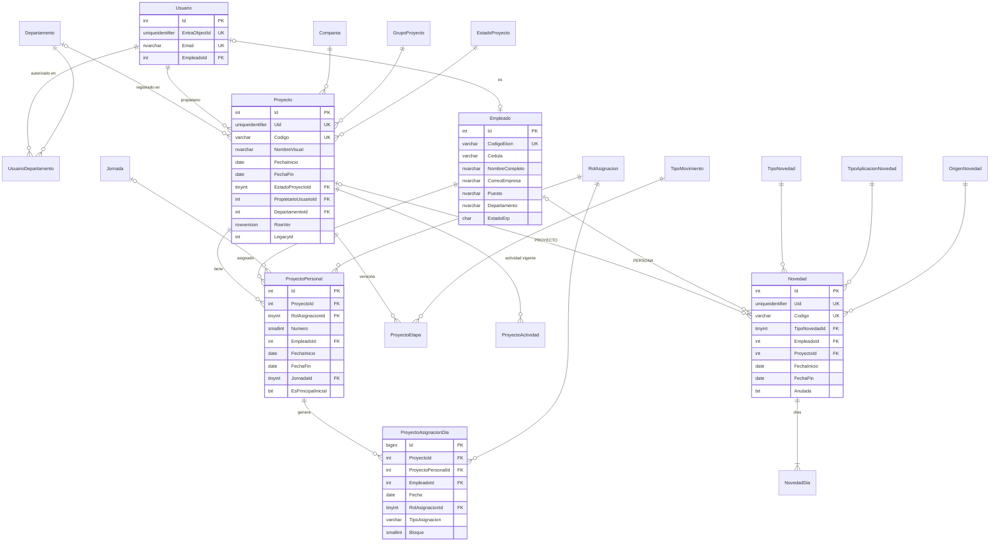

# FASE 2 — Análisis de listas y modelo de datos (Módulo Proyectos)
 
Script completo: `claude/FASE_2_modelo_profesiograma.sql` (validado sintácticamente: 66 sentencias).
 
---
 
## 0. Cierre de Fase 1 — respuestas incorporadas
 
| # | Tema | Decisión |
|---|---|---|
| 1 | App PERMISO MEDICO | Sigue escribiendo en la lista `NOVEDADES ASISTENCIA`. La nueva app **sincroniza** esas novedades (job periódico) como origen `PERMISOS_MEDICOS`, de solo lectura. |
| 2 | Visibilidad | Solo el propietario ve sus proyectos. Se deja parametrizable (`PROYECTO_VISIBILIDAD = CREADOR / DEPARTAMENTO`) y el proyecto guarda su `DepartamentoId`. |
| 3 | Novedad GENERAL | Solo administradores y usuarios autorizados (antes: fila 666). |
| 4 | Novedades | CRUD completo sobre las creadas por esta app: editar días (tabla `NovedadDia`) y anular (borrado lógico). |
| 5 | Edición de proyecto | Se amplía: horario, almuerzo, fechas y datos generales editables, con registro de etapa `EDICION_CABECERA`. |
| 6 | Fecha inicio | Editable (se corrige C24). |
| 7 | CARGO INFOR | Catálogo `CargoInfor` con CRUD e importación desde Excel. A futuro, desde API. |
| 8 | Límites | 20 principales / 20 backs, configurables en `Parametro`. |
| 9 | MIGRADO | Los 51 proyectos ya están en listas normalizadas (DETALLE ≈ 5.000 filas). Se migra solo desde las listas nuevas. |
| 10 | API empleados | `POST :7048/api/EvolutionEmployee/EmployeesEvolution` → reemplaza `ESTRUCTURA GENERAL`. |
 
### Nuevo hallazgo
 
| # | Hallazgo | Tratamiento |
|---|---|---|
| C29 | En `SIG PROYECTOS`, `Creado por` (Author) = `gestor.administrativosig@` y `CORREO_CREADOR` = `gestor.sig@` para el mismo registro. El correo **no es un identificador confiable** (alias / UPN distinto). | La identidad se basa en `EntraObjectId` (claim `oid`). En la migración, el propietario se toma de `CORREO_CREADOR` (la app lo usa para visibilidad). [PENDIENTE confirmar si ambos correos son la misma persona] |
| C30 | Las novedades de PERMISO MEDICO identifican a la persona por `Fechas.Ekon`; `Persona.Correo` a veces está vacío y no existe `Persona.Ekon`. | Resolución de empleado por EKON; el correo es secundario. |
| C31 | La API de empleados devuelve datos sensibles (salario, BPR, fecha de nacimiento, teléfono, correo personal, dirección). | La caché `Empleado` guarda **solo** datos laborales necesarios. Nada sensible se persiste. |
 
---
 
## 1. Convenciones
 
| Elemento | Convención |
|---|---|
| Tablas | PascalCase, **singular**, esquema `dbo` (`Proyecto`, `ProyectoPersonal`). |
| PK | `Id` (INT/BIGINT IDENTITY). Catálogos con Id fijo TINYINT + `Codigo` estable. |
| FK | `<Entidad>Id`. Nombres: `PK_`, `FK_`, `UQ_`, `UX_` (índice único), `IX_`, `CK_`, `DF_`. |
| Fechas de negocio | `DATE` (sin hora ni zona). |
| Marcas de tiempo | `DATETIME2(0)` en **UTC**; la UI convierte a Ecuador (UTC-5). |
| Auditoría | `CreadoPorId`, `FechaCreacion`, `ModificadoPorId`, `FechaModificacion` en todas las tablas. |
| Borrado lógico | `Eliminado` (Proyecto), `Anulada` (Novedad), `Activo` (catálogos, usuarios). |
| Trazabilidad | `LegacyId` (ID de SharePoint) + `Uid` original donde existía. |
| Concurrencia | `ROWVERSION` en `Proyecto` y `Novedad`. |
 
---
 
## 2. Mapeo lista → tabla
 
### 2.1 SIG PROYECTOS → `Proyecto` (+ `Compania`, `UsuarioDepartamento`)
 
| Columna SP | Tipo SP | Uso en app | Destino |
|---|---|---|---|
| ID | Counter | LookUp por ID | `Proyecto.LegacyId` |
| Title | Text | Código `PRY-…` / fila `666` | `Proyecto.Codigo` (666 → se descarta como proyecto) |
| PROYECTO_UID | Text | Clave de relación | `Proyecto.Uid` |
| PROJECT_UID | Note | Legado (C2) | Se descarta (igual a PROYECTO_UID) |
| INF_GENERAL | Note (JSON) | Legado | **No se migra** |
| ASIGNACIONES | Note (JSON ~1 MB) | Legado | **No se migra** |
| ASIGNAR_PERSONAL | Note | FOR SEI 11 (fuera de alcance) | No se migra en esta fase (0/4 con datos) |
| PermisosGenerales | Note (JSON) | Solo fila 666 | → `Usuario` + `UsuarioDepartamento` (+ `Departamento`) |
| ESTADO | Choice | Máquina de estados | `EstadoProyectoId` → catálogo `EstadoProyecto` |
| MIGRADO | Boolean | Control de migración | Se descarta (todos migrados) |
| CORREO_CREADOR / USUARIO_CREADOR | Text | Visibilidad | `PropietarioUsuarioId`, `CreadoPorId` → `Usuario` |
| NOMBRE_PROYECTO | Text | Listados, cronograma | `NombreVisual` |
| GRUPO | Text | CAMPO/PLANTA/OFICINAS | `GrupoProyectoId` → catálogo |
| COMPANY_ID / COMPANIA_NOMBRE / COMPANIA_RUC | Number/Text | Cabecera, reporte | `CompaniaId` → `Compania` (caché ERP) |
| PROJECT_ID_EKON | Text | Reporte (PROYECTO) | `ProyectoErpId` |
| DIMENSION_DESC | Text | Nombre visual planta | `DimensionDescripcion` (+ `DimensionUegpId` desde JSON [SUPUESTO: solo para proyectos PLANTA]) |
| ACTIVITY_ID / DESC / TYPE | Text | Actividad vigente | → `ProyectoActividad` (vigente por fecha); no se duplica en cabecera |
| HORARIO_CODIGO / HORARIO_DESC | Text | Horario | `HorarioCodigo` (INT), `HorarioDescripcion` |
| HORA_ENTRADA / HORA_SALIDA | Text "0700" | Reporte | `HoraEntrada` / `HoraSalida` TIME(0) |
| HORAS / HORAS_TRABAJADAS | Text "1100" | Informativo | `HorasJornadaMin` / `HorasTrabajadasMin` (minutos) |
| TIPO_HORARIO | Text | Informativo | `TipoHorario` |
| SALIDA_ALMUERZO / REGRESO_ALMUERZO | Text "13:00:00" | Reporte | TIME(0) |
| FECHA_INICIO / FECHA_FIN | DateTime (solo fecha) | Rango | DATE |
| Created / Author / Modified / Editor | Sistema | — | `FechaCreacion`, `CreadoPorId`, `FechaModificacion`, `ModificadoPorId` |
 
### 2.2 SIG_ASIGNACIONES_PERSONAL → `ProyectoPersonal`
 
| Columna SP | Tipo | Destino |
|---|---|---|
| Title (`PRY|ROL|n`) | Text | Se descarta (derivable) |
| PROYECTO_UID | Text | `ProyectoId` (join por `Proyecto.Uid`) |
| ROL | Text | `RolAsignacionId` (1/2) |
| PERSONA_ID | Number | `Numero` |
| PRINCIPAL_ID_RELACIONADO | Number (0/55 con datos) | `PrincipalRelacionadoId` (FK auto-referencia) |
| EKON / NOMBRE / CEDULA / CORREO | Number/Text | `EmpleadoId` → `Empleado` |
| CARGO | Text | `CargoAsignado` (snapshot) |
| FECHA_INICIO / FECHA_FIN | DateTime | DATE |
| DIAS_TRABAJO / DIAS_DESCANSO | Number | TINYINT (copia de jornada) |
| JORNADA_CODIGO / JORNADA_DESCRIPCION | Text | `JornadaId` → `Jornada` |
| ES_PRINCIPAL_INICIAL | Boolean | BIT |
| TIPO_REGISTRO | Text (Jornada/Descanso) | `TipoRegistro` CHECK ('JORNADA','DESCANSO') |
| OBSERVACION | Text | NVARCHAR(500) |
 
### 2.3 SIG_ASIGNACIONES_DETALLE → `ProyectoAsignacionDia`
 
| Columna SP | Tipo | Destino |
|---|---|---|
| Title (CLAVE) | Text | Se descarta → `UQ (ProyectoId, EmpleadoId, Fecha, RolAsignacionId)` |
| PROYECTO_UID | Text | `ProyectoId` |
| CODIGO_PROYECTO / NOMBRE_PROYECTO / CORREO_CREADOR | Text | Se descartan (denormalizados; están en `Proyecto`) |
| FECHA | DateTime | DATE |
| EKON / NOMBRE_RESPONSABLE / CEDULA / CORREO_RESPONSABLE / CARGO | — | `EmpleadoId` (+ `ProyectoPersonalId`) |
| ROL | Text | `RolAsignacionId` (1/2/3) |
| TIPO_ASIGNACION | Text | CHECK ('AUTO','MANUAL') |
| BLOQUE | Number | SMALLINT |
| PRINCIPAL_ID / BACK_ID | Number | `ProyectoPersonalId` (resuelto por Proyecto + Rol + Número) |
 
### 2.4 SIG_HISTORIAL → `ProyectoEtapa`
 
| Columna SP | Tipo | Destino |
|---|---|---|
| Title (tipo movimiento) | Text | `TipoMovimientoId` |
| PROYECTO_UID | Text | `ProyectoId` |
| ETAPA_ID | Text (GUID) | `EtapaUid` |
| VERSION | Number | `Version` (UQ por proyecto) |
| ESTADO_PROYECTO | Text | `EstadoProyectoId` |
| FECHA_REGISTRO / USUARIO / CORREO_REGISTRO | DateTime/Text | `FechaCreacion` (UTC) / `CreadoPorId` |
| FECHA_INICIO / FECHA_FIN | DateTime | DATE |
| FECHA_CORTE | **Text, vacía 24/24 (C1)** | DATE NULL (se migra NULL) |
| ACTIVITY_ID | Text | `ActividadCodigo` |
| SNAPSHOT_PERSONAL | Note (JSON) | NVARCHAR(MAX) con `ISJSON` |
 
### 2.5 SIG_HISTORIAL_ACTIVIDADES → `ProyectoActividad`
 
| Columna SP | Destino |
|---|---|
| Title (GUID) | `MovimientoUid` |
| PROYECTO_UID | `ProyectoId` |
| VERSION / TIPO_MOVIMIENTO | `Version` / `TipoMovimientoId` |
| FECHA_REGISTRO / USUARIO / CORREO | auditoría |
| FECHA_INICIO / FECHA_FIN | DATE |
| ACTIVITY_ID / DESCRIPTION / TYPE | `ActividadCodigo`, `ActividadDescripcion`, `ActividadTipo` |
 
### 2.6 NOVEDADES ASISTENCIA → `Novedad` + `NovedadDia`
 
| Columna SP | Tipo | Destino |
|---|---|---|
| Title (`NOV-…`) | Text | `Codigo` |
| NOVEDAD_UID | Text | `Uid` (clave de sincronización) |
| TIPO_APLICACION | Text | `TipoAplicacionNovedadId` |
| FECHA_INICIO / FECHA_FIN | DateTime | DATE |
| CORREO_PERSONA | Text | Auxiliar para resolver `EmpleadoId` |
| PROJECT_UID | Text | `ProyectoId` |
| COMPANY_ID | Number | Se descarta (derivable del proyecto) |
| ESTADO_NOVEDAD | Text ("ACTIVA") | `Anulada = 0` |
| DETALLE_JSON.TipoNovedad / ObservacionExcel | JSON | `TipoNovedadId` |
| DETALLE_JSON.Dias[] | JSON | `NovedadDia` (una fila por fecha) |
| DETALLE_JSON.Persona.Ekon / Fechas.Ekon | JSON | `EmpleadoId` (C30) |
| DETALLE_JSON.OrigenPermiso | JSON | `OrigenNovedadId` |
| DETALLE_JSON.Origen | JSON | `OrigenArea` |
| DETALLE_JSON.Registro | JSON | `RegistradoPorNombre/Correo` |
| DETALLE_JSON (completo) | JSON | `DetalleOrigenJson` (trazabilidad) |
| Datos adjuntos | — | 0 en la muestra → sin tabla de adjuntos en esta fase |
 
### 2.7 Fuentes que no son listas
 
| Fuente | Destino |
|---|---|
| `colCatalogoNovedades` (App.OnStart) + PERMISO MEDICO | `TipoNovedad` (con colores, siglas y reglas de aplicabilidad) |
| Jornadas fijas (Switch) | `Jornada` |
| Grupos fijos | `GrupoProyecto` |
| Switch CARGO INFOR | `CargoInfor` |
| Correos SuperAdmin fijos | App Role de Entra `Admin` (Fase 5) |
| Límites / opciones de almuerzo / rango cronograma | `Parametro` |
| API EvolutionEmployee | `Empleado` (caché sincronizada) |
| API COMPANIAS | `Compania` (caché al usar) |
 
---
 
## 3. Diagrama ER
 

 
(Tablas sin detalle en el diagrama: `Parametro`, `CargoInfor`, `Compania` y los catálogos. Todas llevan auditoría.)
 
---
 
## 4. Justificación de decisiones
 
| # | Decisión | Motivo |
|---|---|---|
| J1 | **Empleado como caché** de la API, sincronizada por job (Fase 4). | Búsquedas y cronograma rápidos con JOIN; integridad referencial; la app no depende de la API en cada pantalla. Solo campos laborales (C31). |
| J2 | Clave de empleado = `CodigoEkon` (codPersona), VARCHAR. | Es el identificador usado en todas las listas (EKON). En SP era Number y se exportaba como "2.448" (C3). [SUPUESTO: único entre empresas] |
| J3 | `Usuario` separado de `Empleado`. | Usuario = identidad Entra (quién usa la app); Empleado = maestro ERP (a quién se asigna). No todo empleado es usuario. |
| J4 | `UsuarioDepartamento` reemplaza el JSON de la fila 666. | Elimina la búsqueda por subcadena (C10) y el registro "configuración dentro de datos". |
| J5 | `ProyectoAsignacionDia.EmpleadoId` redundante con **FK compuesta** a `ProyectoPersonal(Id, ProyectoId, EmpleadoId)`. | Permite el índice `(EmpleadoId, Fecha)` para detectar cruces en una sola consulta, sin riesgo de inconsistencia. |
| J6 | Los cruces **no** se fuerzan con un índice único global. | La regla depende del estado del proyecto (solo vigentes) y excluye DESCANSO. Se valida en la capa de dominio dentro de una transacción con bloqueo (`sp_getapplock` por empleado) — Fase 5. |
| J7 | `DiasTrabajo` / `DiasDescanso` copiados en `ProyectoPersonal`. | La jornada es un catálogo editable; la asignación debe conservar el ciclo con el que se generó. |
| J8 | Actividad **no** se guarda en la cabecera. | Tiene vigencia por fechas; la cabecera duplicaba el dato. La vista `vwProyectoResumen` muestra la vigente. |
| J9 | Datos ERP de proyecto/dimensión/horario como columnas snapshot en `Proyecto`. | Son referencias externas sin API de consulta por Id confiable; se guarda lo que el usuario seleccionó. |
| J10 | `NovedadDia` normalizada. | Permite editar días puntuales (CRUD pedido) y consultar el cronograma por fecha con índice. |
| J11 | `SnapshotPersonal` y `DetalleOrigenJson` se mantienen como JSON. | Solo auditoría/trazabilidad; no se consultan. Validados con `ISJSON`. |
| J12 | Catálogos como tablas con Id fijo; enumeraciones técnicas de 2 valores (`TipoRegistro`, `TipoAsignacion`) como CHECK. | Los catálogos se muestran en UI y pueden crecer; los CHECK son invariantes internos. |
| J13 | `PropietarioUsuarioId` distinto de `CreadoPorId`. | Permite reasignar proyectos si el creador sale (C22) sin alterar la auditoría. |
| J14 | `ROWVERSION` en Proyecto y Novedad. | Evita sobrescrituras entre ediciones concurrentes (C20). |
| J15 | Fechas de negocio en `DATE`. | Elimina el problema de zona horaria (07:00Z/08:00Z) para los datos migrados y nuevos. |
| J16 | Códigos `PRY-…` y `NOV-…` se conservan con índice único. | Continuidad para los usuarios; el índice evita duplicados que hoy no se controlan. |
 
---
 
## 5. Riesgos revisados en esta fase
 
| Riesgo | Tratamiento en el modelo |
|---|---|
| Fechas UTC / Ecuador | `DATE` para negocio; `DATETIME2` UTC para auditoría; `Parametro.ZONA_HORARIA`. |
| > 5.000 elementos | DETALLE ≈ 5.000: la exportación usará paginación REST (`$top=5000` + `__next`) — Fase 3. |
| Personas inexistentes en Entra/ERP | `Empleado.EsOrigenLegado`; `Usuario.EntraObjectId` nullable hasta el primer login. |
| Author/Editor originales | Mapeados a `CreadoPorId` / `ModificadoPorId` y fechas originales. |
| Numeraciones | Índices únicos en `Codigo` y `Uid`. |
| Choices cambiantes | `EstadoProyecto.INACTIVO` conservado para históricos. |
| Datos sensibles | Excluidos de la caché de empleados (C31). |
| Dependencias externas | PERMISO MEDICO → sincronización por `Novedad.Uid`, origen no editable. |
 
---
 
## 6. Resumen de la fase
 
### Decisiones
- 22 tablas (8 catálogos, 5 de configuración/seguridad, 2 cachés ERP, 5 de proyectos, 2 de novedades) y 2 vistas.
- Singular PascalCase, `dbo`, auditoría completa, `LegacyId` en todas las tablas migradas.
### Supuestos
- [SUPUESTO] `codPersona` (EKON) es único entre empresas.
- [SUPUESTO] SQL Server 2017 o superior.
- [SUPUESTO] `DimensionUegpId` solo existe en el JSON; se extraerá de `INF_GENERAL` en la migración (única lectura del JSON).
### Pendientes
1. Versión de SQL Server de pruebas y producción.
2. ¿`gestor.sig@` y `gestor.administrativosig@` son la misma persona (C29)?
3. Excel de cargos → código Infor (adjuntarlo).
4. ¿`codPersona` es único entre empresas (codEmpresa)?
5. Códigos ERP de los 7 departamentos/unidades (`Departamento.CodigoErp`), para filtrar personas por `codDepartamento`/`codUnidad`.
6. ¿El parámetro `estado` de la API acepta vacío para traer todos (activos e inactivos)? Se necesitan inactivos para resolver históricos.
7. ¿Con qué frecuencia debe sincronizarse PERMISO MEDICO (propuesta: cada 1 hora)?
---
 
## 7. Respuestas a pendientes (2026-09-29)
 
| # | Respuesta | Ajuste al modelo |
|---|---|---|
| 1 | Versión SQL Server: por verificar | Script `sql/00_diagnostico_sqlserver.sql` + endpoint `/api/health/db`. |
| 2 | `gestor.sig@` y `gestor.administrativosig@` son personas distintas | [PENDIENTE] confirmar quién es el dueño real de los 3 proyectos; propietario por defecto = `CORREO_CREADOR`. |
| 3 | Cargos: se alimentan desde la API (puestos) y se asigna el código Infor en una interfaz | `CargoInfor` se llena con los `Puesto` distintos de `Empleado`; el usuario completa `CodigoInfor` (nullable hasta asignarse). |
| 4 | `codPersona` es único | Se mantiene `UQ_Empleado_CodigoEkon`. |
| 5 | Departamentos por **nombre** | `Departamento.Nombre` se compara con `Empleado.Departamento` / `Empleado.Unidad`. `CodigoErp` queda opcional. |
| 6 | La API devuelve todos; se quieren solo activos | Sincronización con `estado = "A"`. Empleados históricos no activos se crean desde la migración con `EsOrigenLegado = 1`. |
| 7 | Sincronización PERMISO MEDICO manual | Acción manual "Sincronizar novedades externas" (solo admin), no job programado. |
 
## 8. Resultado del diagnóstico de SQL Server (2026-09-29)
 
| Dato | Valor |
|---|---|
| Servidor | `NIQUEL\SSDEV` (instancia con nombre) |
| Versión | 15.0.2190.7 → **SQL Server 2019**, Enterprise (64-bit) |
| Base consultada | `Acceso` (base por defecto del login; nivel de compatibilidad **100**) |
| Permisos | CREATE TABLE = 1, CREATE SCHEMA = 1, db_owner = 1 (login `sa`) |
 
Decisión: se crea una base dedicada `PROFESIOGRAMA_DEV` con compatibilidad 150 y un login propio `profesiograma_app` (no se usa `sa` ni la base `Acceso`). El modelo de la Fase 2 es compatible con SQL Server 2019 sin cambios.
 
## 9. Entorno de desarrollo verificado (2026-09-29)
 
| Elemento | Estado |
|---|---|
| Solución .NET 10 (`D:\PROYECTOS\Profesiograma`) | Compila y ejecuta (SDK 10.0.401) |
| Base `PROFESIOGRAMA_DEV` en `NIQUEL\SSDEV` | Creada, collation `Modern_Spanish_CI_AS`, compatibilidad 150 |
| Login `profesiograma_dev` | db_owner solo de `PROFESIOGRAMA_DEV` |
| `/api/health/db` | OK — `cumpleRequisitos: true` |
| Observación | SQL Server 2019 en nivel **RTM** (sin Cumulative Updates). Recomendar a TI aplicar el último CU. |
 
Estándar de logins adoptado (igual que `SED_*`): `profesiograma_dev`, `profesiograma_test`, `profesiograma_prod_app` + `profesiograma_prod_migrator`.
 