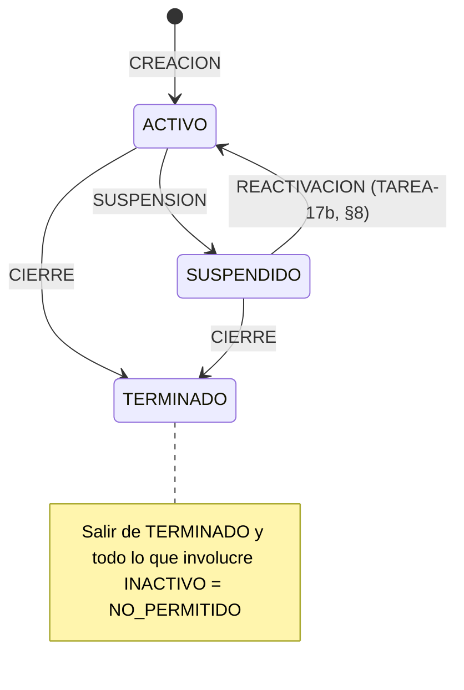

# FASE 5 — Diseño: Estados del proyecto (suspensión y cierre)

**Fecha:** 2026-10-01 (TAREA-14). **Implementado:** SUSPENSION y CIERRE (backend, TAREA-14; frontend, TAREA-15); REACTIVACION (backend, TAREA-17b, §8; verificado en prueba manual el 05/10/2026). **Pendiente:** frontend de la reactivación (TAREA-19).
**Origen:** `docs/origen/powerapps/ConfigurarProyecto_1.pa.yaml`:
- `estadoEdit_1.OnChange` (l. 446);
- `fechaMovimientoEstadoEdit_1.OnChange` (l. 491);
- `Aplicar estado_1.OnSelect` (l. 578–769);
- Registrar (l. 2214–2745).

## 1. Máquina de estados (E1)

| Origen \ Destino | ACTIVO | SUSPENDIDO | INACTIVO | TERMINADO |
|---|---|---|---|---|
| ACTIVO | SIN_CAMBIO | SUSPENSION | NO_PERMITIDO | CIERRE |
| SUSPENDIDO | REACTIVACION | SIN_CAMBIO | NO_PERMITIDO | CIERRE |
| INACTIVO | NO_PERMITIDO | NO_PERMITIDO | SIN_CAMBIO | NO_PERMITIDO |
| TERMINADO | NO_PERMITIDO | NO_PERMITIDO | NO_PERMITIDO | SIN_CAMBIO |

- `App.Domain/Proyectos/Estados/MaquinaEstadosProyecto` (lógica pura) trabaja con los **códigos** del catálogo, no con los Id.
- Un código desconocido se trata como NO_PERMITIDO.
- **Decisión:** REACTIVACION no se registra con `cambio-estado`: necesita el motor con fecha de corte (TAREA-16), el personal nuevo y la nueva fecha fin (H5). Tiene sus propios endpoints (TAREA-17b, §8); `cambio-estado` con destino ACTIVO desde SUSPENDIDO responde 400 "La reactivación se registra con la opción Reactivar.".

## 2. Reglas

| Id | Regla |
|---|---|
| E1 | Movimiento según la tabla de la sección 1. SIN_CAMBIO, NO_PERMITIDO y REACTIVACION → 400 (la reactivación va por §8) |
| E2 | La fecha F es obligatoria, con `FechaInicio ≤ F ≤ FechaFin` del proyecto. **Inclusiva**: el día F se conserva (D1). **C11 (TAREA-18):** la fecha solo se valida si el movimiento es SUSPENSION o CIERRE; con SIN_CAMBIO, NO_PERMITIDO, REACTIVACION o un estado desconocido el 400 trae solo el error de `estadoDestino` (pendiente 29) |
| E3 | Recorte (`RecorteProyecto`, lógica pura): • se eliminan los días con `Fecha > F` de cualquier rol, incluidos los DESCANSO AUTO y MANUAL (también los descansos de backs posteriores a la fecha fin del proyecto, P3 → decisión 2026-10-01); • se elimina el personal con `FechaInicio > F`; • se recorta a F el personal con `FechaFin > F`, sin cambiar `DiasDescanso` (pendiente 23 → TAREA-16); • se eliminan las actividades que empiezan después de F y se recorta a F la `FechaFin` de las que terminan después (H3); • un back que cubría a un principal eliminado queda **sin principal relacionado** (la FK no permite la referencia), con advertencia "El back {n} ({nombre}) quedará sin principal relacionado."; • en el proyecto: `FechaFin = F` y estado = destino |
| E4 | Etapa nueva (la actividad se calcula con la regla común `ActividadVigente` desde la TAREA-18b, con corte = F: mismo resultado que antes): • `Version` = máx + 1, calculada dentro de la transacción; • `TipoMovimiento` = SUSPENSION o CIERRE; `Estado` = destino; • `FechaInicio` = inicio del proyecto; `FechaFin` = `FechaCorte` = F; • `ActividadCodigo` = actividad vigente en F (la de mayor versión si se solapan); • snapshot JSON del personal **resultante**, en el mismo formato que la creación (`SnapshotPersonal`, sin cédula ni correo) |
| E5 | Política Gestor y visibilidad R1: Admin ve cualquier proyecto; los demás solo los propios. Un proyecto no visible, eliminado o inexistente responde 404 |
| E6 | Si F es anterior a hoy en Ecuador (`FechaNegocio`), se muestra la advertencia (no bloqueante) "Se eliminarán días ya transcurridos." (D2, H2) |

## 3. API

- `POST /api/proyectos/{id:int}/cambio-estado/previsualizar` → 200 `CambioEstadoPrevisualizacionDto`. No guarda nada.
  - Campos: `movimiento`, `estadoActual`, `estadoNuevo`, `fecha`, `fechaFinActual`, `fechaFinNueva`, `advertencias`.
  - `diasEliminados[{empleado, rol, cantidad, desde, hasta}]`
  - `personalEliminado[{empleado, rol, numero, fechaInicio, fechaFin}]`
  - `personalRecortado[{…, fechaFinAnterior, fechaFinNueva}]`
  - `actividadesAfectadas[{actividadCodigo, version, fechaInicio, fechaFinAnterior, fechaFinNueva, accion: RECORTADA|ELIMINADA}]`
  - `empleado = {id, codigoEkon, nombreCompleto}`, sin cédula ni correo.
- `POST /api/proyectos/{id:int}/cambio-estado` → 200 `{ id, estado, version }`.
- Cuerpo de ambos: `{ "estadoDestino": "SUSPENDIDO" | "TERMINADO", "fecha": "yyyy-MM-dd" }`.
- Errores:
  - 400 `ValidationProblem` (claves `estadoDestino` y `fecha`; título "Los datos del cambio de estado no son válidos.");
  - 404;
  - 409 "El proyecto cambió de estado; vuelve a cargarlo.";
  - 503 si el registro está ocupado (manejador existente).

| Mensaje (400) | Caso |
|---|---|
| El estado destino es obligatorio. | Falta `estadoDestino` |
| El estado destino 'XYZ' no existe. | Código desconocido |
| El proyecto ya está en estado {X}. | SIN_CAMBIO |
| La reactivación se registra con la opción Reactivar. | REACTIVACION (TAREA-17b; antes "La reactivación todavía no está disponible.") |
| Este cambio de estado no está permitido desde el estado actual ({ORIGEN} → {DESTINO}). | NO_PERMITIDO |
| La fecha del movimiento es obligatoria. | Falta `fecha` (solo SUSPENSION o CIERRE, C11) |
| La fecha del movimiento no puede ser menor a la fecha de inicio del proyecto (dd/MM/yyyy). | F < inicio |
| La fecha del movimiento no puede ser mayor a la fecha fin del proyecto (dd/MM/yyyy). | F > fin |

## 4. Registro (una transacción, `ITransaccionAsignaciones` con `sp_getapplock`)

1. Se valida y se calcula el plan fuera de la transacción.
2. Dentro del bloqueo se vuelve a leer el proyecto.
   - Si el estado cambió, o si F ya no es válida porque cambiaron las fechas → **409**.
   - Si no, se recalcula el plan con los datos leídos dentro de la transacción.
3. `ExecuteDelete` de los días (`Fecha > F`, o del personal que se elimina, por defensa). Va primero por la FK compuesta Restrict.
4. **SaveChanges 1:** la referencia a principales eliminados pasa a `null` (FK autorreferenciada Restrict) y se recorta la `FechaFin` del personal.
5. **SaveChanges 2:** se elimina el personal y las actividades, se recortan actividades, se actualiza el proyecto (con `RowVer`) y se inserta la etapa.
6. Si todo va bien se confirma. Ante cualquier excepción se revierte.
   - `DbUpdateConcurrencyException` (`RowVer`) o un duplicado en `UQ_ProyectoEtapa_Version` → 409.

**Auditoría:** proyecto, personal y actividades se actualizan con seguimiento, así que `AuditoriaInterceptor` llena `ModificadoPorId` y `FechaModificacion`, y `CreadoPorId` en la etapa. Los días borrados con `ExecuteDelete` no pasan por el interceptor, pero desaparecen. `ProyectoAsignacionDia` sí tiene columnas de auditoría.

**Numeración:** no se renumera el personal. Los huecos en `Numero` se mantienen, como `PERSONA_ID` en el original.

## 5. Hallazgos

| Id | Hallazgo | Decisión |
|---|---|---|
| H1 | CIERRE desde SUSPENDIDO: la suspensión dejó `FechaFin` = fecha de suspensión, así que la fecha de cierre solo puede ser ≤ esa fecha | Se mantiene como en el original. El frontend (TAREA-15) propondrá la `FechaFin` actual como valor por defecto |
| H2 | Una fecha de movimiento pasada borra días ya transcurridos, que pudieron reportarse a nómina. El original no avisa | Se permite, con la advertencia E6 |
| H3 | El original no recorta `ProyectoActividad` | Aquí se recorta o se elimina (E3) |
| H4 | En la reactivación, el original marca el principal nuevo con `EsPrincipalInicial = true` sin desmarcar el anterior (quedan dos iniciales) | **Resuelto (TAREA-17b, R6):** se mantiene como regla, un inicial por periodo; el responsable es el inicial con mayor `FechaFin`. Pendiente 22: §8.4 |
| H5 | Después de una suspensión, para reactivar hay que ampliar a mano la `FechaFin` (si no, falla "fechas dentro del rango") | **Resuelto (TAREA-17b, R4):** la solicitud de reactivación trae la nueva fecha fin |
| H6 | Al TERMINAR, los días pasados del proyecto dejan de contar para cruces (`EsVigente = 0`). Un proyecto nuevo puede registrarse sobre días ya trabajados en un proyecto terminado | Igual que el original; se mantiene y se documenta |

## 6. Diferencias con la app original

| Id | Original | Esta implementación |
|---|---|---|
| D1 | Versión de etapa = `CountRows(etapas) + 1` | Máx + 1 dentro del applock (`UQ_ProyectoEtapa_Version` como red de seguridad) |
| D2 | Sin transacción: borra **todo** el personal y lo reinserta (Ids nuevos) | Una transacción; actualización en el lugar (los Id se conservan) |
| D3 | `ACTIVITY_ID` de la etapa = actividad actual del proyecto | Actividad vigente en F (E4) |
| D4 | No detecta un cambio de estado simultáneo | Relectura dentro del applock → 409 |
| D5 | Fecha pasada sin aviso | Advertencia E6 |
| D6 | Borra el detalle con `FECHA ≥ F`, reinserta el día F y recalcula su descanso automático (sin efecto neto) | El día F no se toca |
| D7 | Snapshot `{Principales:[…], Backs:[…]}` con `PrincipalId` | Formato de la creación (`SnapshotPersonal`, TAREA-12) |
| D8 | El back conserva `PRINCIPAL_ID_RELACIONADO` aunque el principal se elimine | Referencia a `null` + advertencia (la FK lo exige) |

## 7. Ubicación por capa

| Capa | Archivos |
|---|---|
| Domain | `Proyectos/Estados/MaquinaEstadosProyecto.cs`, `RecorteProyecto.cs` |
| Application | `Proyectos/Estados/` (solicitud, contratos, DTO, `CambioEstadoValidador`, `CambioEstadoServicio`), `Proyectos/SnapshotPersonal.cs` |
| Infrastructure | `Persistencia/Proyectos/CambioEstadoRepositorio.cs` |
| Api | `Endpoints/ProyectoEndpoints.cs` (dos `POST`) |

## 8. Reactivación (SUSPENDIDO → ACTIVO) — TAREA-17b

**Estado:** implementado y **verificado en prueba manual (05/10/2026)**: proyecto de prueba Id 10 (PRY-20261005-98f053), casos a–j y h1–h4 OK (`docs/tareas/TAREA-17b-reporte.md` §6.2). Observación pendiente: el 400 de `cambio-estado` a ACTIVO trae además un error en `fecha` (pendiente 29, TAREA-18).

**Origen** (`ConfigurarProyecto_1.pa.yaml`): `fechaMovimientoEstadoEdit_1.OnChange` (l. 491–549), `Aplicar estado_1` (l. 580–766), Regenerar (cadena de la l. 1910, R‑797–805), Registrar (l. 2275–2291 y 2590–2616).
Reutiliza la TAREA-17: núcleo de `EdicionPersonalValidador`, `CalculoPersonal` (motor `Regenerar`, cruces), `ITransaccionAsignaciones`, la escritura D7 de `EdicionPersonalRepositorio` y `SnapshotPersonal`.

### 8.1 API (política Gestor, visibilidad R1 → 404)
| Endpoint | Respuesta |
|---|---|
| `GET /api/proyectos/{id:int}/reactivacion` | 200 `ReactivacionDto`: `puedeReactivar` + `motivo`, `estadoActual`, `fechaInicio`, `fechaFinActual`, `fechaMinima` (= FechaFin + 1), `principalPropuesto` (`empleado {id, codigoEkon, nombreCompleto, activo}`, `jornada`, `cargo`) o null, `personal` (todo el guardado, con `esPrincipalInicial`), `limites`, `advertencias` |
| `POST …/reactivacion/previsualizar` | 200 `PrevisualizacionReactivacionDto`: los campos de la vista previa de la TAREA-17 (`corte` = R, `personal`, `tramos`, `cruces`, `resumen`, `advertencias`) + `fechaFinActual`, `fechaFinNueva`, `actividad` que se creará (o null). 400 / 404 / 409 (cambiado). No guarda |
| `POST …/reactivacion` | 200 `{ id, estado: "ACTIVO", version }`. 400; 404; 409 con extensiones `cruces` y `resumen`, o "El proyecto cambió; vuelve a cargarlo."; 503 (applock) |

Cuerpo: `{ fecha, fechaFin, principales: [{ clave, empleadoId, jornada, fechaInicio, fechaFin, cargo? }], backs: [{ clave, empleadoId, tipoRegistro, fechaInicio, fechaFin, diasDescanso, principalClave?, principalId?, observacion? }] }`. Todas las personas son nuevas (sin `id`). `principalClave` apunta a un principal del cuerpo; `principalId`, a un principal guardado (todos son históricos). Excluyentes.

### 8.2 Reglas
| Id | Regla |
|---|---|
| R1 | Endpoints de §8.1. `cambio-estado` con destino ACTIVO sigue en 400 con "La reactivación se registra con la opción Reactivar." |
| R2 | Fecha R obligatoria: `FechaFin actual < R ≤ fechaFin`. R futura permitida sin advertencia |
| R3 | R anterior a hoy en Ecuador: se permite con la advertencia "Se generarán días ya transcurridos." |
| R4 | (H5) `fechaFin` pasa a ser la `FechaFin` del proyecto, que queda ACTIVO |
| R5 | Corte C = R. **Todo** el personal guardado es histórico y entra al motor con `ForzarHistorica = true` (resuelve el pendiente 23 y H10). Personas nuevas: `ReglasPersonal` (mismos mensajes), inicio ≥ R, RN08 sobre (inicio del proyecto, `fechaFin`), empleado activo, número máx + 1 por rol sobre todo el personal guardado, máximos 20/20 sobre las nuevas, al menos 1 principal. **TAREA-19y:** al menos 1 persona nueva (principal o back) → si no, 400 `personal`; con `PROYECTO_EXIGE_PRINCIPAL = 1`, al menos 1 principal → 400 `principales` (§10) |
| R6 | (H4) El primer principal del cuerpo empieza exactamente en R y se guarda con `EsPrincipalInicial = true`. No se desmarca el anterior: un inicial por periodo; el responsable es el inicial con mayor `FechaFin` (como `vwProyectoResumen`). **TAREA-19y:** solo con backs, al menos uno empieza en R (400 `backs` "Al menos un back debe empezar en la fecha de reactivación (dd/MM/yyyy).") y no hay inicial nuevo |
| R7 | Propuesta del GET: el principal inicial con mayor `FechaFin`. Si no hay ninguno, el principal con mayor `FechaFin` con la advertencia "El proyecto no tiene principal inicial; se propone el último principal.". Empleado inactivo: se propone con "El empleado del principal propuesto no está activo; elige otro principal." (el registro lo rechaza). Sin principales: null con "El proyecto no tiene principales; agrega uno.". Solo si `puedeReactivar` |
| R8 | (H11) Si hay una actividad vigente en la fecha de suspensión (la `FechaFin` actual; la de mayor versión), se crea una fila nueva en `ProyectoActividad`: `TipoMovimiento` REACTIVACION, mismo código, descripción y tipo, de R a `fechaFin`, versión máx + 1. Sin actividad no se crea nada. Las filas existentes no cambian |
| R9 | Etapa REACTIVACION, estado ACTIVO, `FechaInicio` = R, `FechaFin` = `fechaFin`, `FechaCorte` = R, actividad vigente en R (la nueva), snapshot del personal resultante (históricas incluidas) |
| R10 | El cambio de actividad al reactivar queda fuera de alcance (TAREA-18) |
| H12 | Un back existente con `FechaFin < C` sin días DESCANSO guardados después de su `FechaFin` (la suspensión los borró) es histórico (`ForzarHistorica`). Se aplica en Application para la edición (TAREA-17) y la reactivación. Ver §8.4 |

**Mensajes (400)**
| Clave | Mensaje |
|---|---|
| `proyecto` | Solo se puede reactivar un proyecto SUSPENDIDO (estado actual: X). (también es el `motivo` del GET) |
| `fecha` | La fecha de reactivación es obligatoria. |
| `fecha` | La fecha de reactivación debe ser posterior a la fecha fin actual del proyecto (dd/MM/yyyy). |
| `fechaFin` | La fecha fin es obligatoria. |
| `fechaFin` | La fecha fin no puede ser anterior a la fecha de reactivación (dd/MM/yyyy). |
| `principales` | Se requiere al menos 1 principal(es). |
| `principales[0].fechaInicio` | El primer principal debe empezar en la fecha de reactivación (dd/MM/yyyy). |
| `…fechaInicio` | La fecha de inicio no puede ser anterior a la fecha de reactivación (dd/MM/yyyy). |
| `…id` | En la reactivación todas las personas son nuevas; no envíe id. (un solo error por fila) |
| (resto) | Los de `ReglasPersonal` y la TAREA-17, sin cambios (RN08 con la nueva fecha fin, jornada, empleado activo, relación del back, máximos) |

Título del `ValidationProblem`: "Los datos de la reactivación no son válidos.".

### 8.3 Escritura (una transacción con applock)
1. Fuera del bloqueo se valida y se calcula todo; si hay cruces, 409 sin abrir la transacción.
2. Dentro se vuelve a leer y a recalcular (motor, cruces internos, históricos y externos con `excluirProyectoId`). Si ya no es válido (p. ej. el estado ya no es SUSPENDIDO) o cambió la `FechaFin` → 409 "El proyecto cambió; vuelve a cargarlo.".
3. `ExecuteDelete` de los días con `Fecha ≥ R` (no debería haber; por defensa).
4. **SaveChanges 1:** personas nuevas (la primera, inicial) y el proyecto (ACTIVO, `FechaFin`; `RowVer` por seguimiento).
5. **SaveChanges 2:** relaciones de los backs con los principales nuevos.
6. **SaveChanges 3:** días, actividad REACTIVACION (versión máx + 1 leída dentro del bloqueo) y etapa (versión máx + 1).
7. `DbUpdateConcurrencyException` o duplicado (`UQ_ProyectoEtapa_Version`, `UQ_ProyectoActividad_Version`, `UQ_ProyectoPersonal_Numero`) → 409.

### 8.4 Hallazgos
| Id | Hallazgo (verificado en el origen) | Decisión |
|---|---|---|
| H9 | El original no exige R > fecha de suspensión: solo valida `fecha ≥ inicio` y omite `fecha > fin` para REACTIVACION (l. 589–604). Al elegir la fecha vacía los vigentes (l. 499–500) y Registrar guarda los históricos con `FechaFin < R` + los nuevos (l. 2283–2286): con R ≤ F pierde al personal con fin ≥ R | R2: `FechaFin actual < R` (400) |
| H10 | Un back con `FechaFin < R ≤ FechaFin + DiasDescanso` no pasa el filtro de históricos (l. 2285) y ya se vació de los vigentes: el original lo elimina | R5: todo el personal guardado queda histórico (pendiente 23 resuelto) |
| H11 | Nuestra suspensión recorta la actividad a F (H3): sin tratamiento no hay actividad vigente desde R. El original no recorta ni crea actividades al reactivar (solo CAMBIO_ACTIVIDAD, l. 2297–2334) | R8: fila REACTIVACION nueva |
| H12 | Después de reactivar, la ACTUALIZACION_PERSONAL (TAREA-17) clasificaba al back recortado por `FechaFin + DiasDescanso ≥ C` y regeneraba el descanso que la suspensión borró (mismo problema del pendiente 23, en la edición) | Regla H12 (§8.2). Consulta `ConsultaBacksConDescansoPosterior`; las pruebas de la TAREA-17 pasan sin cambios |
| Pendiente 22 | El recorte puede eliminar al principal inicial original o a todos los principales: el inicial no tiene que empezar en el inicio del proyecto (en el original el bloqueo de esa fecha está comentado, `GestionProyecto.pa.yaml` l. 1316–1324; aquí el inicial es `Numero == 1`, sin exigir la fecha) | Resuelto con R7 (respaldo: último principal, o null con advertencia) |

### 8.5 Diferencias con el original
| Id | Original | Esta implementación |
|---|---|---|
| D9 | Sin principal inicial: solo un error "No se encontró un principal a cargo para reactivar el proyecto" (l. 518–522) | R7: respaldo con el último principal, o propuesta null; siempre con advertencia |
| D10 | Acepta R ≤ fecha de suspensión (H9) | R2: `FechaFin actual < R ≤ fechaFin` |
| D11 | No crea actividad | R8: actividad REACTIVACION de R a la nueva fecha fin |
| D12 | Elimina el back con descanso pendiente (H10) | R5: todo el personal guardado queda histórico (`ForzarHistorica`) |
| D13 | Versión `CountRows + 1`, `ACTIVITY_ID` = actividad actual del proyecto | Versión máx + 1 dentro del applock; actividad vigente en R |

### 8.6 Ubicación por capa
| Capa | Archivos |
|---|---|
| Application | `Proyectos/Reactivacion/` (`ReactivacionContratos`, `ReactivacionDtos`, `ReactivacionValidador`, `ReactivacionServicio`); `Proyectos/Personal/CalculoPersonal.cs` (extraído de `EdicionPersonalServicio`) y núcleo `ValidarPersonal` de `EdicionPersonalValidador` |
| Infrastructure | `Persistencia/Proyectos/EdicionPersonalRepositorio.cs` (`IReactivacionRepositorio`, `AplicarAsync` con `Reactivacion`, consultas `ConsultaActividadParaReactivar` y `ConsultaBacksConDescansoPosterior`) |
| Api | `Endpoints/ProyectoEndpoints.cs` (GET + dos POST) |

## 9. Token de concurrencia `versionProyecto` (TAREA-19x, pendiente 32)

Origen: V15 de la TAREA-19a (06/10/2026). Una pestaña con una vista previa vieja registraba sobre los datos de otra sin
409, porque el cliente no indicaba sobre qué versión decidió; la relectura en el applock solo detecta carreras dentro
de la misma petición.

- **Token:** `versionProyecto` (entero) = última versión de etapa del proyecto (`ProyectoEtapa.Version` máxima; 0 si no
  tiene etapas). Sirve porque toda escritura de un proyecto crea una etapa (`00_ESTADO_ACTUAL.md` §7.1, regla 3). El
  `RowVer` de `Proyecto` no sirve: la actualización de personal no modifica esa fila.
- **Orden en el registro** (`VersionProyecto.cs`, mismos pasos en los 4 servicios):
  1. `versionProyecto` ausente → **400** `versionProyecto` "Falta la versión del proyecto; vuelve a cargarlo.", antes de
     comprobar la visibilidad, sin leer la base ni abrir la transacción;
  2. lectura y cálculo de fuera (404 si no existe o no es visible);
  3. **comprobación previa:** token ≠ versión actual → **409** "El proyecto cambió; vuelve a cargarlo.", ANTES de
     cualquier 400 de validación, "No hay cambios para registrar." (C9) o cruces;
  4. dentro del applock: las relecturas existentes y, antes de calcular la versión nueva (actual + 1), la
     **comprobación definitiva** del token → 409 si otro registro entró antes del bloqueo.
- **Vistas previas y GET:** devuelven `versionProyecto` leído **antes** que los datos: si alguien escribe en medio, el
  token queda más viejo que los datos y el registro da 409 (el error cae del lado seguro). Las vistas previas no
  exigen el token (son de lectura) y lo ignoran si llega.
- **Frontend:** el diálogo registra con el `versionProyecto` de la vista previa vigente (`aSolicitudRegistroCambio`,
  `aSolicitudRegistroCabecera`); con 409 o con 400 `versionProyecto` ofrece "Recargar datos del proyecto".
- La creación no aplica (no hay versión previa). El GET del detalle no devuelve el token (P4).

**En este documento:**
- `POST …/cambio-estado/previsualizar` devuelve `versionProyecto`; `POST …/cambio-estado` lo exige. Token viejo → 409
  "El proyecto cambió; vuelve a cargarlo." (`EstadoCambio.Cambiado`). La relectura existente dentro del applock (el
  estado cambió) conserva su 409 "El proyecto cambió de estado; vuelve a cargarlo." (`EstadoCambio.Conflicto`).
- Reactivación (§8): `GET …/reactivacion` y `POST …/reactivacion/previsualizar` devuelven `versionProyecto`;
  `POST …/reactivacion` lo exige (409 `Cambiado`; el 409 con `extensions.cruces` sigue siendo el de cruces).

## 10. Reactivación solo con backs (TAREA-19y, pendiente 33)

- **R5:** al menos 1 persona nueva (principal o back), porque todo el personal guardado queda histórico. Con
  `PROYECTO_EXIGE_PRINCIPAL = 1` vuelve "Se requiere al menos 1 principal(es)." (`principales`).
- **R6:** con principales nuevos, el primero empieza en R y es el inicial (como antes). Solo con backs, al menos uno
  empieza en R; si no, 400 `backs`. Sin principales nuevos no hay inicial nuevo: el responsable sigue siendo el inicial
  histórico, si lo hay.
- **R7 sin cambios:** la propuesta del GET sigue siendo el principal (inicial → último); sin principales, null con
  "El proyecto no tiene principales; agrega uno." (no propone backs).
- **Advertencia** (no bloquea): "El proyecto no tendrá principal: el responsable quedará vacío." si no hay principales
  nuevos ni principal inicial histórico.
- **Corrección:** `ReactivacionServicio.CrearCambio` usaba `c.Plan.Principales[0]` (fallaba con solo backs);
  `ReactivacionAplicar.ClavePrincipalInicial` pasa a ser anulable (null = sin inicial nuevo).
