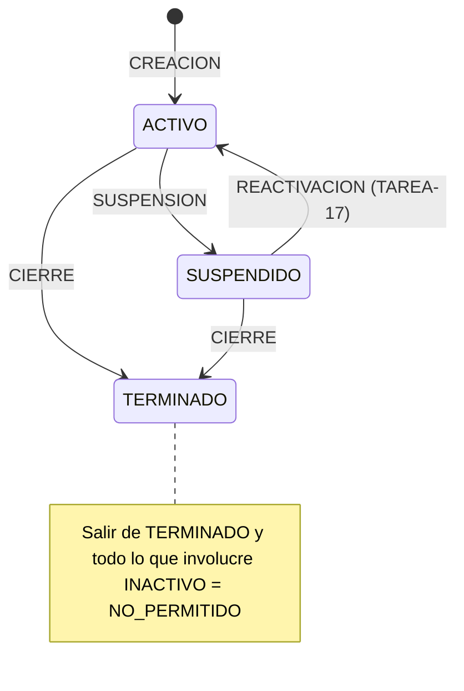

# FASE 5 — Diseño: Estados del proyecto (suspensión y cierre)

**Fecha:** 2026-10-01 (TAREA-14). **Implementado:** SUSPENSION y CIERRE (backend). **Pendiente:** REACTIVACION (TAREA-17), frontend (TAREA-15).
**Origen:** `docs/origen/powerapps/ConfigurarProyecto_1.pa.yaml`:
- `estadoEdit_1.OnChange` (l. 446);
- `fechaMovimientoEstadoEdit_1.OnChange` (l. 491);
- `Aplicar estado_1.OnSelect` (l. 578–769);
- Registrar (l. 2214–2745).

## 1. Máquina de estados (E1)

| Origen \ Destino | ACTIVO | SUSPENDIDO | INACTIVO | TERMINADO |
|---|---|---|---|---|
| ACTIVO | SIN_CAMBIO | SUSPENSION | NO_PERMITIDO | CIERRE |
| SUSPENDIDO | REACTIVACION | SIN_CAMBIO | NO_PERMITIDO | CIERRE |
| INACTIVO | NO_PERMITIDO | NO_PERMITIDO | SIN_CAMBIO | NO_PERMITIDO |
| TERMINADO | NO_PERMITIDO | NO_PERMITIDO | NO_PERMITIDO | SIN_CAMBIO |

- `App.Domain/Proyectos/Estados/MaquinaEstadosProyecto` (lógica pura) trabaja con los **códigos** del catálogo, no con los Id.
- Un código desconocido se trata como NO_PERMITIDO.
- **Decisión:** REACTIVACION queda fuera de la TAREA-14. Necesita el motor con fecha de corte (TAREA-16) y la solicitud con la nueva fecha fin (H5), así que va en la TAREA-17. Hasta entonces la API responde 400 con "La reactivación todavía no está disponible.".

## 2. Reglas

| Id | Regla |
|---|---|
| E1 | Movimiento según la tabla de la sección 1. SIN_CAMBIO, NO_PERMITIDO y REACTIVACION → 400 |
| E2 | La fecha F es obligatoria, con `FechaInicio ≤ F ≤ FechaFin` del proyecto. **Inclusiva**: el día F se conserva (D1) |
| E3 | Recorte (`RecorteProyecto`, lógica pura): • se eliminan los días con `Fecha > F` de cualquier rol, incluidos los DESCANSO AUTO y MANUAL (también los descansos de backs posteriores a la fecha fin del proyecto, P3 → decisión 2026-10-01); • se elimina el personal con `FechaInicio > F`; • se recorta a F el personal con `FechaFin > F`, sin cambiar `DiasDescanso` (pendiente 23 → TAREA-16); • se eliminan las actividades que empiezan después de F y se recorta a F la `FechaFin` de las que terminan después (H3); • un back que cubría a un principal eliminado queda **sin principal relacionado** (la FK no permite la referencia), con advertencia "El back {n} ({nombre}) quedará sin principal relacionado."; • en el proyecto: `FechaFin = F` y estado = destino |
| E4 | Etapa nueva: • `Version` = máx + 1, calculada dentro de la transacción; • `TipoMovimiento` = SUSPENSION o CIERRE; `Estado` = destino; • `FechaInicio` = inicio del proyecto; `FechaFin` = `FechaCorte` = F; • `ActividadCodigo` = actividad vigente en F (la de mayor versión si se solapan); • snapshot JSON del personal **resultante**, en el mismo formato que la creación (`SnapshotPersonal`, sin cédula ni correo) |
| E5 | Política Gestor y visibilidad R1: Admin ve cualquier proyecto; los demás solo los propios. Un proyecto no visible, eliminado o inexistente responde 404 |
| E6 | Si F es anterior a hoy en Ecuador (`FechaNegocio`), se muestra la advertencia (no bloqueante) "Se eliminarán días ya transcurridos." (D2, H2) |

## 3. API

- `POST /api/proyectos/{id:int}/cambio-estado/previsualizar` → 200 `CambioEstadoPrevisualizacionDto`. No guarda nada.
  - Campos: `movimiento`, `estadoActual`, `estadoNuevo`, `fecha`, `fechaFinActual`, `fechaFinNueva`, `advertencias`.
  - `diasEliminados[{empleado, rol, cantidad, desde, hasta}]`
  - `personalEliminado[{empleado, rol, numero, fechaInicio, fechaFin}]`
  - `personalRecortado[{…, fechaFinAnterior, fechaFinNueva}]`
  - `actividadesAfectadas[{actividadCodigo, version, fechaInicio, fechaFinAnterior, fechaFinNueva, accion: RECORTADA|ELIMINADA}]`
  - `empleado = {id, codigoEkon, nombreCompleto}`, sin cédula ni correo.
- `POST /api/proyectos/{id:int}/cambio-estado` → 200 `{ id, estado, version }`.
- Cuerpo de ambos: `{ "estadoDestino": "SUSPENDIDO" | "TERMINADO", "fecha": "yyyy-MM-dd" }`.
- Errores:
  - 400 `ValidationProblem` (claves `estadoDestino` y `fecha`; título "Los datos del cambio de estado no son válidos.");
  - 404;
  - 409 "El proyecto cambió de estado; vuelve a cargarlo.";
  - 503 si el registro está ocupado (manejador existente).

| Mensaje (400) | Caso |
|---|---|
| El estado destino es obligatorio. | Falta `estadoDestino` |
| El estado destino 'XYZ' no existe. | Código desconocido |
| El proyecto ya está en estado {X}. | SIN_CAMBIO |
| La reactivación todavía no está disponible. | REACTIVACION |
| Este cambio de estado no está permitido desde el estado actual ({ORIGEN} → {DESTINO}). | NO_PERMITIDO |
| La fecha del movimiento es obligatoria. | Falta `fecha` |
| La fecha del movimiento no puede ser menor a la fecha de inicio del proyecto (dd/MM/yyyy). | F < inicio |
| La fecha del movimiento no puede ser mayor a la fecha fin del proyecto (dd/MM/yyyy). | F > fin |

## 4. Registro (una transacción, `ITransaccionAsignaciones` con `sp_getapplock`)

1. Se valida y se calcula el plan fuera de la transacción.
2. Dentro del bloqueo se vuelve a leer el proyecto.
   - Si el estado cambió, o si F ya no es válida porque cambiaron las fechas → **409**.
   - Si no, se recalcula el plan con los datos leídos dentro de la transacción.
3. `ExecuteDelete` de los días (`Fecha > F`, o del personal que se elimina, por defensa). Va primero por la FK compuesta Restrict.
4. **SaveChanges 1:** la referencia a principales eliminados pasa a `null` (FK autorreferenciada Restrict) y se recorta la `FechaFin` del personal.
5. **SaveChanges 2:** se elimina el personal y las actividades, se recortan actividades, se actualiza el proyecto (con `RowVer`) y se inserta la etapa.
6. Si todo va bien se confirma. Ante cualquier excepción se revierte.
   - `DbUpdateConcurrencyException` (`RowVer`) o un duplicado en `UQ_ProyectoEtapa_Version` → 409.

**Auditoría:** proyecto, personal y actividades se actualizan con seguimiento, así que `AuditoriaInterceptor` llena `ModificadoPorId` y `FechaModificacion`, y `CreadoPorId` en la etapa. Los días borrados con `ExecuteDelete` no pasan por el interceptor, pero desaparecen. `ProyectoAsignacionDia` sí tiene columnas de auditoría.

**Numeración:** no se renumera el personal. Los huecos en `Numero` se mantienen, como `PERSONA_ID` en el original.

## 5. Hallazgos

| Id | Hallazgo | Decisión |
|---|---|---|
| H1 | CIERRE desde SUSPENDIDO: la suspensión dejó `FechaFin` = fecha de suspensión, así que la fecha de cierre solo puede ser ≤ esa fecha | Se mantiene como en el original. El frontend (TAREA-15) propondrá la `FechaFin` actual como valor por defecto |
| H2 | Una fecha de movimiento pasada borra días ya transcurridos, que pudieron reportarse a nómina. El original no avisa | Se permite, con la advertencia E6 |
| H3 | El original no recorta `ProyectoActividad` | Aquí se recorta o se elimina (E3) |
| H4 | En la reactivación, el original marca el principal nuevo con `EsPrincipalInicial = true` sin desmarcar el anterior (quedan dos iniciales) | TAREA-17. Relacionado: pendiente 22 (el recorte puede eliminar al principal inicial) |
| H5 | Después de una suspensión, para reactivar hay que ampliar a mano la `FechaFin` (si no, falla "fechas dentro del rango") | TAREA-17: la solicitud de reactivación traerá la nueva fecha fin |
| H6 | Al TERMINAR, los días pasados del proyecto dejan de contar para cruces (`EsVigente = 0`). Un proyecto nuevo puede registrarse sobre días ya trabajados en un proyecto terminado | Igual que el original; se mantiene y se documenta |

## 6. Diferencias con la app original

| Id | Original | Esta implementación |
|---|---|---|
| D1 | Versión de etapa = `CountRows(etapas) + 1` | Máx + 1 dentro del applock (`UQ_ProyectoEtapa_Version` como red de seguridad) |
| D2 | Sin transacción: borra **todo** el personal y lo reinserta (Ids nuevos) | Una transacción; actualización en el lugar (los Id se conservan) |
| D3 | `ACTIVITY_ID` de la etapa = actividad actual del proyecto | Actividad vigente en F (E4) |
| D4 | No detecta un cambio de estado simultáneo | Relectura dentro del applock → 409 |
| D5 | Fecha pasada sin aviso | Advertencia E6 |
| D6 | Borra el detalle con `FECHA ≥ F`, reinserta el día F y recalcula su descanso automático (sin efecto neto) | El día F no se toca |
| D7 | Snapshot `{Principales:[…], Backs:[…]}` con `PrincipalId` | Formato de la creación (`SnapshotPersonal`, TAREA-12) |
| D8 | El back conserva `PRINCIPAL_ID_RELACIONADO` aunque el principal se elimine | Referencia a `null` + advertencia (la FK lo exige) |

## 7. Ubicación por capa

| Capa | Archivos |
|---|---|
| Domain | `Proyectos/Estados/MaquinaEstadosProyecto.cs`, `RecorteProyecto.cs` |
| Application | `Proyectos/Estados/` (solicitud, contratos, DTO, `CambioEstadoValidador`, `CambioEstadoServicio`), `Proyectos/SnapshotPersonal.cs` |
| Infrastructure | `Persistencia/Proyectos/CambioEstadoRepositorio.cs` |
| Api | `Endpoints/ProyectoEndpoints.cs` (dos `POST`) |
